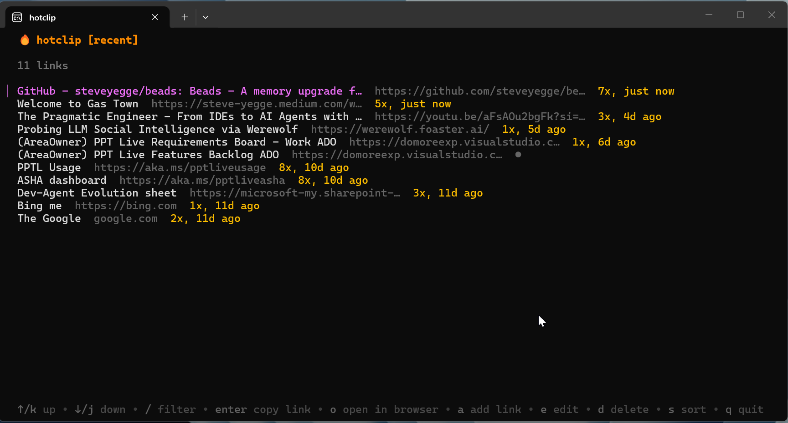

# hotclip

A fast terminal UI for saving, sorting, and sharing links. Built with [Bubble Tea](https://charm.land/bubbletea).



## Features

- **Rich clipboard copy** — copies links as clickable hyperlinks (HTML), not just plain text
- **Auto title fetch** — grabs the page `<title>` when you add a URL
- **Activity tracking** — tracks use count and last-used time per link
- **Sort modes** — cycle between recent, most shared, and alphabetical
- **Fuzzy filter** — type `/` to search across titles, URLs, and tags
- **Open in browser** — launch any link directly from the TUI
- **Local JSON store** — everything lives in `~/.hotclip/links.json`

## Install

```
go install github.com/bridgkick/hotclip/cmd/hotclip@latest
```

Or build from source:

```
git clone https://github.com/bridgkick/hotclip.git
cd hotclip
go build -o hotclip.exe ./cmd/hotclip
```

## Keybindings

| Key | Action |
|-------|----------------|
| `enter` | Copy link |
| `o` | Open in browser |
| `a` | Add link |
| `e` | Edit link |
| `d` | Delete link |
| `s` | Cycle sort mode |
| `/` | Filter |
| `q` | Quit |

## Built with

- [Bubble Tea](https://charm.land/bubbletea) — TUI framework
- [Bubbles](https://charm.land/bubbles) — TUI components
- [Lip Gloss](https://charm.land/lipgloss) — Styling
